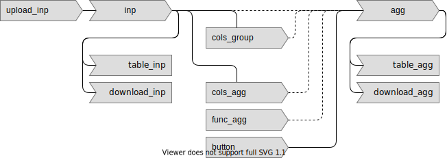

# reactivity-demo-shiny

<!-- badges: start -->
<!-- badges: end -->

The goal of this repository is to show how to implement a reactive data-science app using Shiny.

This is part of [*Data-Science Reactivity: Three Ways*](https://ijlyttle.github.io/reactivity-three-ways-book/), an effort to show how to make the same "app", using:

-   R: [Shiny](https://shiny.rstudio.com/)
-   Python: [Dash](https://dash.plotly.com/)
-   JavaScript: [Observable](https://observablehq.com/@observablehq/five-minute-introduction)

## Aggregate: local

There's a [deployed version](https://ijlyttle.shinyapps.io/aggregate-local) of this app.

